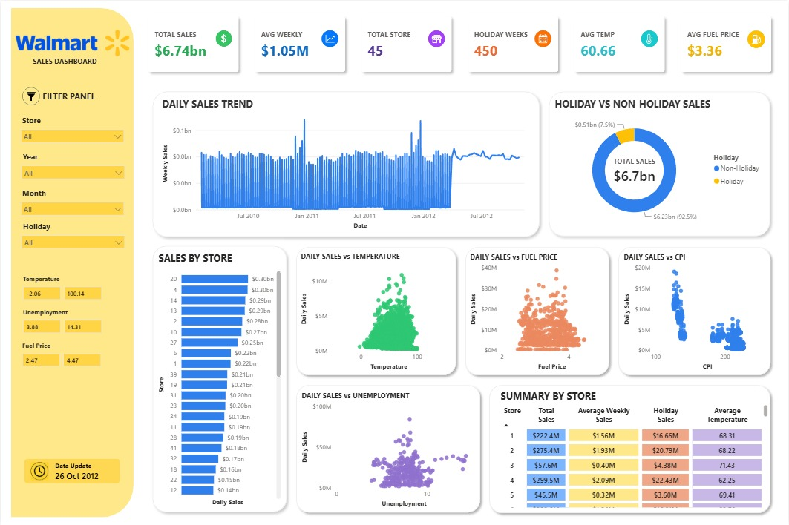

# 🛒 Walmart Analysis Dashboard

An interactive Power BI dashboard built to analyze Walmart sales performance across stores, time periods, and business metrics. This dashboard provides insights into sales trends, holiday impact, store performance, and the relationship between sales and external economic factors.

---

## 📊 Dashboard Preview

> Upload screenshot dashboard ke repository dengan nama `dashboard.png`, lalu gunakan kode berikut:



---

## 🎯 Project Objective

The objective of this dashboard is to help stakeholders monitor Walmart's sales performance and identify key business trends through interactive visualizations. Users can explore sales by store, analyze seasonal patterns, and evaluate how factors such as holidays, temperature, fuel prices, CPI, and unemployment influence sales.

---

## 📌 Key Features

- 📈 Total Sales KPI
- 💰 Average Weekly Sales
- 🏪 Total Number of Stores
- 🎉 Holiday Weeks Overview
- 🌡️ Average Temperature
- ⛽ Average Fuel Price
- 📅 Daily Sales Trend Analysis
- 🏬 Sales Performance by Store
- 📊 Holiday vs Non-Holiday Sales Comparison
- 🌡️ Sales vs Temperature Analysis
- ⛽ Sales vs Fuel Price Analysis
- 📉 Sales vs CPI Analysis
- 👥 Sales vs Unemployment Analysis
- 📋 Store Performance Summary Table
- 🎛️ Interactive Filters (Store, Year, Month, Holiday, Temperature, Unemployment, Fuel Price)

---

## 🛠️ Tools & Technologies

- Power BI Desktop
- Power Query
- DAX
- Data Modeling
- Interactive Slicers

---

## 📈 Key Insights

- Walmart generated **$6.74B** in total sales.
- Average weekly sales reached **$1.05M**.
- Most sales were generated during **non-holiday periods**.
- Sales performance varies significantly across stores.
- External factors such as temperature, fuel price, CPI, and unemployment show varying relationships with weekly sales.

---

## 📂 Repository Structure

```
Walmart-Analysis-Dashboard/
│
├── walmart dashboard.pbip
├── walmart dashboard.Report/
├── walmart dashboard.SemanticModel/
├── dashboard.png
└── README.md
```

---

## 📁 Dataset

This project uses the Walmart Sales dataset containing:

- Weekly Sales
- Store Information
- Holiday Flag
- Temperature
- Fuel Price
- Consumer Price Index (CPI)
- Unemployment Rate
- Date

---

## 🚀 How to Open

1. Clone this repository.
2. Open the `.pbip` project using **Power BI Desktop**.
3. Refresh the data if necessary.
4. Explore the dashboard using the interactive filters.

---

## 👩‍💻 Author

**Nadia Annisa Chasiavera**

GitHub: https://github.com/NadiaAnnisaChasiavera
